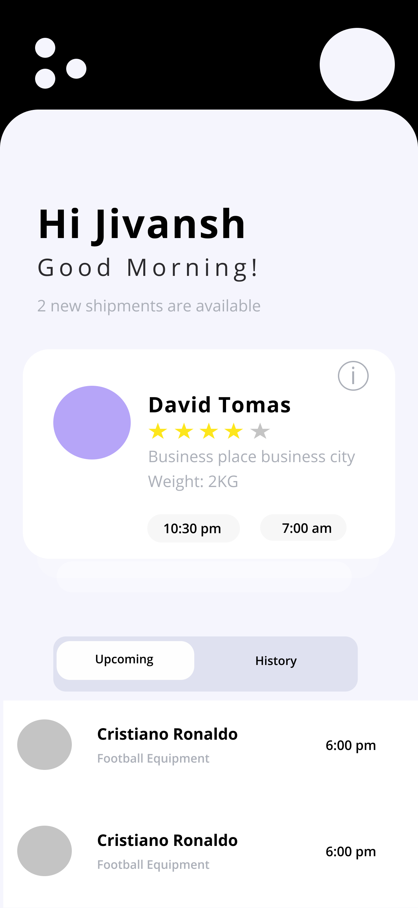
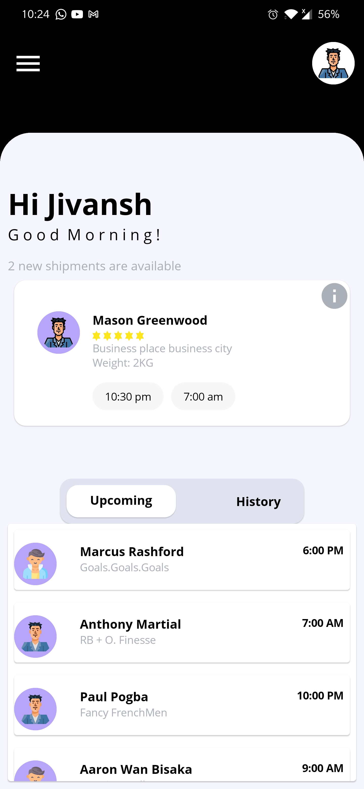

# Design Challenge

## Goal :goal_net:
- Recreate UI
- To learn Jetpack Compose 

### Desired End Product
<p align = "center">
  
  
</p>

### To test code

```bash
git clone https://github.com/parzuko/ServiceAppCompose.git
cd app/src/main
cd java/com/jivansh/serviceapp

# Run the MainActivity.kt File
```